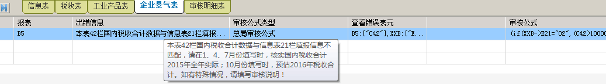

## 网上申报百晓生

---
**一、 系统登录**

    我在登录网上办税平台时，为什么提示不存在该纳税人的信息，无法登录？
   
   网上办税平台只提取国税金三核心征管系统中当前登记状态为“正常”类的企业信息，如企业当前状态为“非正常”、“注销”、“清算”等状态，平台将不予提取，相关涉税业务请到主管税务机关办理。

    新办企业如何开通网上申报

   请咨询96005656坐席电话或咨询www.96005656.com在线客服。技术支持人员核对信息后为纳税人开通使用。

    三证合一后，新税号如何登录网上办税平台？

   三证合一后的纳税人，在国税主管税务机关办理税务登记变更的第二天，可使用新税号及原密码登录网上办税平台。如变更后的当天需登录网上办税平台或无法登录的请咨询96005656坐席电话或咨询www.96005656.com在线客服。或者纳税人可以在中税云服务平台首页点击网上办税平台注册，填写相关信息后，实现自主维护。若有其他问题可咨询在线客服。

    忘记网上办税平台密码怎么办?

   若您忘记了登录密码，请拨打全省服务电话96005656或咨询www.96005656.com在线客服。由服务单位技术人员对您的密码进行重置。为提高系统使用安全，会对通话进行录音及，服务人员会向您确认企业相关信息，确认相符后再进行密码重置。或者纳税人可以在中税云服务平台首页点击办税平台密码找回，填写相关信息后，实现自主重置。若有其他问题可咨询在线客服。

---

**二、企业所得税**

    提取企业所得税申报表

   因申报表类型有变化，需重新提取。

    重新提取企业所得税申报表预缴税额、累计金额

   前一申报期数据在金三中有更正等情况，需重提企业所得税预缴税额、累计金额。

    固定资产加速折旧（扣除）明细表本期没有数据，也必须要填写吗？

   如果本年度内某一申报期报送了《固定资产加速折旧(扣除)明细表》，享受了固定资产加速折旧优惠，则本年度内以后所有申报期间，企业必须填报本表。
   
     固定资产加速折旧（扣除）明细表只有合计行次显示有累计数据，无本期数据的如何填写？

   因《固定资产加速折旧（扣除）明细表》本月有升级，请按实际发生业务在第4、8、9、13、14等列的明细行次选择填写，有计算公式的单元格实现自动计算 。
   如有前期数据填写错误情况的，请联系主管税务机关在金三中调整或联系96005656删除期初数据后，重新填写。

     我单位企业所得税实际利润额未超过30万元，应如何确定小微优惠率？

   请参照以下办法确定您单位应享受的小微优惠率：
  
   1、全额适用减半征税政策（享受15%优惠比率）

（1）季（月）度预缴申报时，累计利润额或应纳税所得额不超过20万元（含）的小型微利企业
（2）2015年10月1日（含，下同）之后成立，季（月）度预缴申报时，累计利润或应纳税所得额不超过30万元的小型微利企业。
 
  2、2015年10月1日之前成立，累计利润额或应纳税所得额大于20万元但不超过30万元的小型微利企业，分段计算2015年10月1日之前和之后累计利润额（应纳税所得额）。为简化计算，企业可以按照国家税务总局下发的《小型微利企业所得税优惠比例查询表》计算填报该项优惠政策。表中“企业成立时间”项指税务登记时间。

    我单位企业所得税为查账征收类，《减免所得税额明细表（附表3）》第三行“其中：减半征税”自动计算显示的减免税额大于第二行“一、符合条件的小型微利企业”，主表第12行按照附表三第三行填写后为何不能确认申报？

   根据国家税务总局公告([2015]年第31号)规定：《中华人民共和国企业所得税月（季）度预缴纳税申报表（A类，2015年版）》第12行“减免所得税额”应等于《减免所得税额明细表》（附表3）第1行。
   根据国家税务总局 ([2015]年第79号) 公告，2015年四季度《减免所得税额明细表》（附表3）第3行“其中：减半征税”部分企业存在大于本表第2行“一、符合条件的小型微利企业”的情况。

    
    企业所得税申报，符合小型微利企业优惠条件的，如何计算可享受的优惠税额？

  符合小型微利企业优惠条件的，请纳税人根据税务登记日期，参照国家税务总局下发的《小型微利企业所得税优惠比例查询表》查询企业应享受的小微优惠率，计算优惠税额，计算办法如下：
附表三第2行本期数＝当期主表第9行累计数 * 享受优惠比率 -上期第2行累计；具体说明如下：

（1）计算结果如为负数，则本期数填0。

（2）如享受金额>当期主表第11行本期数，则小微优惠税额附表三第2行按当期主表第11行应纳所得税额本期数计算。

（3）其他情况，12行本期金额为享受金额。
附表三第3行本期数＝当期主表第9行累计数 * 享受减半优惠比率 -上期第3行累计；计算结果如为负数，则本期数填0。

     查账征收类企业所得税，如何确认上年度是否符合小微优惠？

   请按以下项目确认您单位上年度申报是否符合小微优惠条件:一是资产总额、从业人数、从事国家非限制和禁止行业三项必须符合给定条件，主表《A100000》第23行“应纳税所得额” <= 30万元；二是主表《A100000》第23行“应纳税所得额”超过30万元的，在月（季）度申报时会弹出提醒框，可自主选择是否享受小微优惠，详细如下：

（一）查账征收企业
 
同时符合以下4项条件是小型微利企业

（1）工业企业

查账征收：（《A000000企业基础信息表》103“所属行业明细代码”为06**至50**，即为工业企业）
①104“从业人数”<=100人；
②且105“资产总额”<=3000万元；
③且107“从事国家非限制和禁止行业选择”为“是”；
④且主表《A100000》第23行“应纳税所得额” <= 30万元。

（2）其他企业

查账征收：（《A000000企业基础信息表》103“所属行业明细代码”不属于06**至50**，即为其他企业）
①104“从业人数”<=80人
②且105“资产总额”<=1000万元；
③且107“从事国家非限制和禁止行业选择”为“是”；
④且主表《A100000》第23行“应纳税所得额”<=30万元。

---
**二-一  所得税季度申报**

     企业所得税季度申报表《不征税收入和税基类减免应纳税所得额明细表（附表1）》为何第12栏等栏次为何封住不让填写？

   享受不征税收入，以及享受免税收入、减计收入、所得减免、研发费用加计扣除及抵扣应纳税所得额等税基类优惠政策的纳税人,请根据相关政策要求在所对应的栏次里填报本期优惠情况。2016年1月1日起，《不征税收入和税基类减免应纳税所得额明细表（附表1）》中第12、13、18、28、29、32、33、34行优惠项屏蔽，不允许填写。
   如有特殊情况，请联系96005656坐席电话反映，将会及时向主管部门上报。

     企业所得税季度申报表《减免所得税额明细表（附表3）》为何第5、7等栏次为何封住不让填写？

   享受减免所得税额优惠的查账征税的纳税人，请根据企业所得税法及相关税收政策规定，填报本期发生的减免所得税优惠情况。前期发现企业数据有填写错误情况，根据当前有效的减免所得税额优惠政策，目前保留的项目已能满足填报要求。2016年1月1日起，《减免所得税额明细表（附表3）》中第5、7、14、15、24、26、28、30行优惠项屏蔽，不允许填写。
   如有特殊情况，请联系96005656坐席电话反映，将会及时向主管部门上报。

     打开季度所得税申报表时，提示逾期未申报信息，应如何处理？

   月（季）度所得税申报时校验是否存在逾期未申报信息。如果纳税人存在前一月（季）度所得税未申报信息时，不允许通过网上办税平台进行本期的申报，需到主管税务机关完成逾期未申报的补报。完成补报后，请联系96005656坐席电话提取信息后进行本期的申报。

     我单位2015年新办企业，资产总额已超过小微优惠标准，季度申报时是否可以选择不享受小微优惠？

  根据国税局相关政策规定，2015年四季度申报期起，年度新办企业，季度预缴时累计利润额不超过30万元的，按照优惠比率自动计算小微优惠金额，强制监控。

     季度所得税，当前季度累计实际利润额未超过30万元符合小微的条件，《减免所得税额明细表（附表3）》第二行、第三行本期数据均为0，主表第12行填写后也不允许确认申报，为什么？

  一是非本年新开业企业请确认上一年度是否符合小微，上一年度《A000000企业基础信息表》中资产总额、从业人数、是否为国家非限制和禁止行业这三项，有一项不符合小微优惠条件的，则次年月（季）度申报时不允许享受小微优惠。
  
  二是确认符合小微优惠条件，请纳税人根据税务登记日期，参照国家税务总局下发的《小型微利企业所得税优惠比例查询表》查询企业应享受的小微优惠率，计算优惠税额，如累计享受的优惠税额已超过当前限额的、或本期应纳税额为0的，则本期小微优惠税额为0。

    我单位2015年新办企业，资产总额已超过小微优惠标准，季度申报时是否可以选择不享受小微优惠？

  根据国税局相关政策规定，2015年四季度申报期起，年度新办企业，季度预缴时累计利润额不超过30万元的，按照优惠比率自动计算小微优惠金额，强制监控。

    我打开季度所得税报表提示“申报数据未正确获取，请与应用服务单位联系”，怎么处理？
  这样的情况联系服务单位，服务人员将报表重新提取即可正常打开。

    我应该怎样判断16年第一季度是否享受小微优惠？

  2016年一季度所得税申报时，判断是否符合小微优惠条件如下：
  首先查看2015年度申报信息是否符合小微，2015年度申报符合小微的，本季度实际利润额累计未超过30万元的纳税人均可享受小微优惠；如2015年度申报不符合小微优惠，但资产总额、从业人数、国家限制或禁止行业均符合小微优惠，仅应纳税所得额超过30万元的，2016年季度申报填写时，请根据弹出的提示信息选择是否享受小微优惠；2015年度申报时资产总额、从业人数、国家限制或禁止行业项
  有一项不符合小微优惠，2016年季度申报不允许享受小微优惠。

    我单位企业所得税是查账征收类，是符合小微优惠的，为何确认申报时提示以下信息，如何处理呢？
 
   符合小微优惠的，《中华人民共和国企业所得税月(季)度预缴纳税申报表（A类，2015年版）》第12行“减:减免所得税额（请填附表3）”为手工填写；《减免所得税额明细表（附表3）》第2行“一、符合条件的小型微利企业”及第3行“其中：减半征税”平台实现了自动计算，但需要用户点击保存按钮，保存本表，确认申报时如有以上提示，请确认两表中的数据是否相同，并确认已保存附表三，然后再确认申报。

    我单位属于查账征收类企业，在进行季度所得税申报时，弥补以前年度亏损额填写后不能保存，该如何处理？
   企业所得税月（季）度预缴纳税申报表（A类）报表的第9行“弥补以前年度亏损”，数据结转自上年度企业所得税弥补亏损明细表中的“可结转以后年度弥补的亏损额合计”，当月（季）度申报时填写此栏数据后，因上年度申报时未正确填写的，网上办税平台校验不通过，无法保存此表。第一季度申报前，请先完成上年度申报。
   如在申报期内，在核心征管系统中调整过台账信息，请联系服务单位重新提取数据。

    季度所得税申报提示正在写征管如何处理？
   当您查询到申报状态显示正在写入征管系统时，可联系服务单位确认。
   常见原因有两种可能：一是申报高峰期，申报数据处于排队等待写入征管状态，这种情况请隔段时间再查询；二是纳税人登记信息有变化，纳税人登记状态为非“正常”类型的，平台不再提取，申报信息也无法写入征管，平台后台对这类信息会定时处理，需纳税人到主管税务机关大厅办理纳税申报业务。

---

**二-二 所得税年度申报**

    我单位进行年度所得税申报时，A000000企业基础信息表的第一行无法选择，如需更正申报该怎么操作？

   网上办税平台只能接收“正常申报”类型的数据，不能进行“更正申报”或“补充申报”，因此本表面向所有用户均默认为“正常申报”，不可自行选择。如有“更正申报”或“补充申报”请到主管税务机关办税服务厅办理；或在金税三期核心征管系统中作废已申报信息后，联系96005656退回网上办税平台年度所得税报表，再重新申报。

    年度企业所得税申报时，有无填表顺序？应按什么顺序进行填报？

   通过网上办税平台进行年度企业所得税申报时，建议按以下顺序填报：

1. A000000企业基础信息表
2. 企业收入明细表
3. 成本支出明细表
4. A104000期间费用明细表
5. A100000中华人民共和国企业所得税年度纳税申报表（A类）
6. 纳税调整类报表（先填子表再填上一级报表）
具体请参照下图（红色边框为必填表）：

    我单位符合小微优惠条件，进行年度所得税申报时， 为何A107040表第一、第二行均为0，且不能手工填写数据，小微优惠金额怎么填写？

  《A107040减免所得税优惠明细表》未自动计算的原因：一是不符合小微优惠条件；二是符合小微优惠条件但《A100000中华人民共和国企业所得税年度纳税申报表（A类）》尚未保存，无法实现自动计算。
  
  解决办法：一是确定《A000000企业基础信息表》及《A100000中华人民共和国企业所得税年度纳税申报表（A类）》相关项是否符合小微优惠；二是参照填表顺序，按顺序分别填写保存相关报表，并在保存《A100000中华人民共和国企业所得税年度纳税申报表（A类）》后，再打开《A107040减免所得税优惠明细表》，符合条件的即可看到自动计算的数据，然后保存本表即可。

    我单位为核定征收类小微企业，进行年度企业所得税申报时，为何不能在“是否属于小型微利企业：”选择“是”？

  请在《中华人民共和国企业所得税月（季）度和年度纳税申报表（B类，2015年版）》中，“年度申报时填报”栏中选择行业、填写从业人数、资产总额（万元），及选择“国家限制和禁止行业:”情况，保存报表时系统将根据您填写的情况及第11行或第14行“应纳税所得额”进行判断，符合条件的，系统自动计算第17、18行小型微利企业减免所得税额。

    年度所得税申报信息写征管系统失败，失败原因：核心征管内部异常||调用核心征管内部服务出错,异常所在server名hxqz_sdgs_svr003，错误原因：1019900000001:系统出现异常！请联系管理员。怎么处理？

   这种情况让纳税人先看下A107040表第29行，企业只填写金额，不选择项目名称的是无法写入征管的，目前年度所得税申报失败的多为此类情况。
 
     年度关联业务往来报告表必须要申报吗？
 
   关于年度关联业务往来报告表申报：

  （1）营业收入过亿的为强制申报。税务机关要求必须申报的，按税务机关要求填写并确认申报。 
  （2）营业收入未过亿，税务机关也未要求填报的，纳税人可不填写，如纳税人已填写或已被退回的不确认申报即可，不需要删除报表权限。

---

**三、增值税**

    申报权限提取

   一是增值税已认定为一般纳税人，确认金三系统中维护的一般纳税人资格信息，重新提取申报数据。

   二是新维护增值税税费种信息的企业，需提取。

   三是财务报表的提取（增值税申报时判断企业是否已申报财务报表），在金三核心征管中维护企业财务报表信息后，平台重新提取。

    基础数据重提

   一是增值税一般纳税人企业反映增值税主表在金三核心征管系统中有过修改，需重提累计数、上期留抵税额等期初数据。

   二是小规模纳税人预缴数确认或提取。
  企业预缴税额情况确认，当前月度申报时，提取到的预缴数大于企业本月实际代开数。需企业到主管税务机关在征管系统中修改，之后平台重新提取。

  三是企业固定资产进项税额抵扣表累计数确认或在核心征管中调整后重提。

    我单位进行增值税申报时，为何不能确认申报提示“主表：一般货物及劳务和应税服务列第12栏本月数不等于附表二：第12栏“税额”+《电信企业总机构使用分支机构传递单情况表》中“传递单进项税额”！”？

  此提示是因数据调整未重新保存主表造成的，请重新保存增值税纳税申报表附列资料（表二）、增值税纳税申报表（适用于增值税一般纳税人）后再确认申报。

    已申报成功，提示扣款失败，如何解决？

  （1）已有明确提示信息，如账户余额不足支付、帐户未签约、帐号户名不符、产品处于密码锁定状态、账户状态错、该账户已作挂失止付、往来户帐户冻洁或暂禁等，请按提示信息做相应处理，如及时存款或到所属主管税务机关签订银税协议。
  
  （2）提示：在核心系统中没有对应的应征信息。此提示有以下两种情况，一是本月申报税款为0；二  是有申报税款，已在国税征收服务大厅缴纳，平台再发起扣款请求时检索到已无应征信息。
 
    打印增值税报表时，提示IE已阻止使用ActiveX控件，无法正常打印怎么办？

  如您在打印报表时，系统出现以下提示：

  请在IE浏览器“工具”菜单下的“Internet选项”中将网上办税平台站点添加到“信任站点”，并在IE浏览器“工具”菜单下的“Internet选项”-----安全页签----自定义级别，启用ActiveX控件方式解决。

    增值税申报表数据填写错误，能否退回重新申报？

   增值税一般纳税人申报表在待比对状态时退回重新申报方式：

  一是联系“96005656全省统一坐席电话”退回重报。

  二是填写“增值税作废申请”由税收管理员审核，审核通过后即可重新申报。
  
  对于已申报成功增值税一般纳税人申报表、小规模纳税人申报表的纳税人，均需先联系主管税务机关在金税三期核心征管系统中作废已申报数据，然后再联系96005656服务电话退回重新申报。

    我已经完成比对并已清卡，但网上办税平台还是提示已发送至一窗式比对系统，请进行抄报税怎么办？

   企业执行比对后的结果在平台的“申报状态”栏都可以查到，当您看到一窗式比对失败的信息时，请按照提示信息逐项检查申报填写的数据与认证数据是否完全一致。
   若您已比对且已清卡，申报平台状态未有更新时，请联系96005656确认。若平台重新获取比对结果，无比对成功的信息时，需到一窗式比对系统中确认，详细解决办法请根据服务单位技术支持人员答复处理。

    申报平台显示一窗式比对失败，提示本期抵扣申报数据为0份，但检查申报表我已填写此份数，请问如何解决？

   
   一窗式比对失败时提示0份的，是因为填写的本期抵扣申报数据与增值税专用发票认证数据不符所致，请在增值税申报表附表二中按增值税专用发票认证数据修改，之后保存申报表主表，确认申报后重新执行比对即可。

    小规模的申报表里第18行预缴数应该是0，现在显示有数据，如何处理？

   增值税小规模申报表（营改增版）第18行预缴数取自国税核心征管系统，网上办税平台在每月月底（一般为每月的最后一天）从国税核心征管系统中提取，企业在申报时对此数据有疑问的，可联系服务单位查询确认。

    附表一中需填写红字发票数据，为负数不能保存报表，怎么处理？

   一般纳税人开具红字发票后，由于要冲减当期销售额和税额，而应纳税额分配与销项税额比例有关，会影响当期应纳税额的计算和入库级次分配。网上办税平台对附表一的第9列、第10列保存时校验不可为负。申报填写方法如下：

（1）冲减红字发票后销售额大于等于零的，纳税人按照现行方式完成纳税申报计算分配应纳税额；
（2）冲减红字发票后销售额小于零的，纳税人按照“应税货物及劳务”和“应税服务”对红字发票进行分类，分别冲减“应税货物及劳务”和“应税服务”销售额，其中小于零的销售额，进行零申报，当期未冲减完的，下期继续冲减。因冲减红字发票导致“一窗式”比对无法通过的，人工强行比对通过。

（3）红字发票冲减销售额有余额的，纳税人应填写红字发票冲减销售额台账，报主管税务机关备案，以便下期继续冲减。

---

**四、海关进口增值税缴款书**

    单位是增值税一般纳税人，按“三证合一”办法变更了登记信息，但上个月用老税号上传了海关进口增值税专用缴款书，这个月使用新税号下载稽核结果通知书里没有信息，怎么办？
    
   请联系96005656，添加老税号信息，用老税号登录网上办税平台下载海关稽核结果通知书，并按照通知书结果进行申报抵扣，一窗式比对时如提示不符，请与税务机关联系。

    海关缴款书录入错误，比对显示重号，如何处理？

   重号是指两个或两个以上的纳税人申请稽核同一份海关缴款书，并且比对的相关数据与海关已核销海关缴款书数据相同。请您到国税主管税务机关在稽核系统中处理。

    我单位下载的海关进口增值税稽核结果通知书，为何已比对相符的票显示为滞留，本月能否抵扣？

   因海关缴款书稽核系统于2月13日已自动生成了稽核结果通知书，在13日之后比对相符的未包含在通知书里，为解决此问题，凡在 2016年2月14日后下载稽核结果通知书后，发现存在此问题的， 96005656接收到此类问题后向省局反映处理。

    海关票怎么采集上传，海关票上传查询与抵扣？

   上传海关票—查看上传情况—查看比对结果—确认下载稽核通知书—报税抵扣。当期抵扣填写表二5栏，待抵扣的填在表二30栏

    稽核结果通知书下载时，不能先查看有多少份比对相符的数据，只能在下载后查看。能否提供下载前查看功能?

   目前平台尚不能在稽核结果通知书下载前获取到通知书内容，只能先通过比对结果查询模块确认已上传的海关票的比对状态，如有滞留票可在申报期结束前两天再下载，以等待滞留票继续参与比对的结果。

    已录入海关缴款书，为何查询不到比对结果，也下载不到稽核结果通知书？

   录入缴款书后，需点击“上传”按钮。未上传的，不发送到稽核系统，不进行比对，也就看不到比对结果，同时无法下载稽核结果通知书。

    我单位已经三证合一，老税号收到的海关票应该怎么办？

   三证合一要变更（或已变更）纳税人识别号的，如需进行海关进口增值税专用缴款书先比对后抵扣信息采集的，用老税号收到的票，在老税号下采集，添加老税号时注明需采集海关进口增值税专用票。

    我是增值税一般纳税人，海关进口增值税专用缴款书信息录错成另一单位的了，已上传且已反馈比对相符，如何处理？

   对于已上传的，平台可清除缴款书采集记录，以能让实际持有该缴款书的企业录入，实际持有单位录入并上传后，比对结果会是重号，请携带相关资料到国税主管税务分局在稽核系统中处理。
   目前网上办税平台对海关票号有校验功能，不允许多次录入。在您录入时发现已有本号码存在，不允许录入时，请联系服务单位处理。

---

**五、预申请事项**

    预申请事项中发票类的开票日期起，开票日期止，这两个都填写不上数字怎么办？

   点击这两个单元格后，会显示日期控件，可以选择，不需手工填写日期。

    预登记申请填写后，提示保存失败怎么办？

   预登记申请信息保存时，校验是否已存在该法人身份证号码的申请信息，已存在的不允许再次申请，请在“开业登记修改查询”中通过受理号、纳税人识别号或法定代表人身份证号码查询修改。

    在进行网上预登记的时候，数据暂存失败是什么原因？

   当您在“网上预登记”中填写数据点击“数据暂存”失败时，请确认：

  （1）是否在国税或地税办理过税务登记，如已办理过则不能再进行网上预登记先根据提示检查，若无误，咨询之前是否提交过，开业登记只能提交一次。

  （2）牵扯日期的栏次格式是否都是纯数字组成，生产经营期限止不要出现汉字，如果是长期经营选9999-12-31；地址栏次字数是否过多（这个栏次有字符的限制）；营业范围是否存在其他符号。

    发票验旧申请时，无法选择发票代码，怎么办？

   发票验旧时，如无法选择发票代码，请先确认是否有库存发票，网上办税平台每天从国税核心征管中获取企业库存发票信息，无发票库存时，不允许填写验旧申请。

    预申请事项里的税务登记类财务会计制度及核算软件备案报告书里的纳税人识别号和纳税人名称没有自动生成,也填写不上，怎么办？

   遇到以上问题时，请联系服务公司处理，需提取企业基本信息。

    我在网上办税平台通过“预申请事项”进行发票验旧时，无法正常打开填写验旧信息，提示存在申请未处理的情况，请问如何处理？

   请检查之前填写的发票验旧系统是否尚未提交，尚未提交且不需通过网上办税平台再发送的验旧信息，请先在“申请业务作废”模块里作废，然后再填写新的发票验旧信息。

---

**六、出口退税**

    添加出口退税功能菜单

   一是纳税人因三证合一，变更了纳税人识别号，在出口退税系统中更新信息，需添加新税号的出口退税功能菜单；二是新办纳税人在出口退税审核系统中维护好资格信息后，要求添加。
   网上办税平台每天晚上从出口退税系统提取符合资格的信息，并自动为纳税人添加出口退税功能菜单；

    我通过网上办税平台进行出口退税远程申报时，必须要进行预申报吗？

   未进行预申报的，可以进行正式申报，在审核系统中没有强制要求必须先完成预申报。
   建议企业先进行预申报，以尽早发现疑点。

    我是出口退税企业，本月没有出口退税业务，是否也需要进行申报？

   生产企业每月均需按时申报，不论是否产生了出口退税业务。
   
   外贸企业可以只在发生业务的月份进行申报。
     
    我是出口退税企业，进行预申报为何提示失败？

   

   2016年1月出口退税企业申报系统进行了升级，生产类企业出口退税申报系统版本为15.0   外贸类企业出口退税申报系统版本为17.0，请升级后再通过网上办税平台进行出口退税预申报、正式申报。

    我单位三证合一后变更了新税号，今天已在税务局出口退税审核系统中变更了登记信息，为什么登录网上办税平台进行预申报时提示“企业信息不存在，请联系管理员”？
   
   
   网上办税平台从税务局出口退税审核系统中提取信息需间隔一天，如有纳税人识别号信息的变更，请间隔一天再登录网上办税平台进行预申报或正式申报。

    出口退税申报系统（单机版客户端）中生成申报数据时选择远程申报，无法直接将申报数据传输到出口退税综合服务平台中,请问如何解决？

   请在出口退税申报系统（单机版客户端）生成申报数据时选择远程申报，申报文件系统将申报数据文件自动存入本地，如未能自动登录网上办税平台，请通过浏览器方式登录，然后点击网上办税平台相关菜单，上传存放在本地已生成的申报数据文件即可。

    出口退税预申报时提示“审核失败，无法读入企业申报商品代码版本”，请问如何处理？

   2016年2月申报期进行出口退税预申报前，请先升级代码库，然后重新生成申报数据进行远程申报。

    我通过网上办税平台进行出口退税远程申报时，必须要进行预申报吗？

   未进行预申报的，可以进行正式申报，在审核系统中没有强制要求必须先完成预申报。建议企业先进行预申报，以尽早发现疑点。

    生产企业已经填写完成单证明细数据采集填写退运已补税（未退税）证明申请，成功保存，要进行生成单证申报数据的时候，显示无数据？

   填写完成退运已补税（未退税）证明申请表后需要点击设置标志即可。

    生产用户提出没有生成明细数据模块，那企业还需要进行预申报吗，如果操作在哪生成预申报数据？

   新版系统调整内容，企业仍需要预申报做预审，在操作生成免抵退申报数据后生成的数据包为预审数据包，如预审无疑点，此数据包可直接作为正式申报的数据包。如有疑点需要撤销数据修改数据后重新生成的免抵退申报数据再进行预审，直到预审无疑点后可作为正式申报的数据包。

    单机版用户提出出口退免税资格认定变更表生成数据后无法打印报表？

   企业操作问题，出口退税资格认定变更表单应录入数据后先打印之后再生成数据，建议企业按照认定向导操作。生成后如想在打印报表需撤销数据到采集状态后打印报表。

    出口退税系统的正式申报怎么不能上传了，以前都是这样操作的？

   出口退税系统本月升级后调整如下：先进行预申报，预申报成功后，在反馈信息下载项中有“转正式申报”,点击“转正式申报”进行正式申报。

    三证合一之后没有出口退税模块怎么处理？

   关于三证合一后出口退税系统资格的维护，目前经与省局出口退税处确认，无出口退税资格或已三证合一未维护新老税号对应关系的，纳税人向主管税务机关出口退税部门反映，通过出口退税系统运维提报，省局出口退税处负责维护。

    三证合一后出口退税预申报反馈提示信用代码与审核系统不一致怎么办？

   出口退税预审时候提示社会信用代码和审核系统（  ）不一致，遇到这种提示，如果版本什么的都对，那就是由于：三证合一之后，重新安装了客户端，首次登陆，有两个空，一个是税号，一个是社会信用代码，两个都填上新的社会统一信用代码，重新上传申报。

**七、重点税源**

    登录网上办税平台后，为什么不显示重点税源模块?

   网上办税平台仅对山东省国家税务局确定名单中的企业开放本模块，未显示此模块的无需申报。若您是重点税源企业，本年度有变更税号的情况时，请用原税号完成当前年度各期申报，下一年度再启用变更后的税号申报。

    税收表第20栏本期数和征管数据不同，如何处理？

   第20栏本期数，系统提取的是上期税收表第30栏的数据，而同栏中的征管数据列是提取本期增值税主表第14栏的数据。可根据本取数口径查看数据的一致性。

    我单位填写保存重点税源信息表时，提示统一社会信用代码与登录税号不一致，该如何处理？

   遇到此提示时，请在重点税源企业基本信息表第35行“统一社会信用代码”项中填写新税号后再保存。

    重点税源企业景气表审核时提示异常，如下所示，请问如何处理？
   

   请按提示信息调整。其中的42栏是总局重点税源信息采集单机版中是按行次标识，平台显示的报表中项目列前没加行次，42栏的提示按栏目说明“国内税收合计”去确认即可。

    企业所有的税费种都已申报成功，但是在填报重点税源税收报表时，征管数据那列不显示数据，也没有限制提示：未获取征管数据的信息，是什么原因？

   重点税源报表中的增值税、消费税、所得税本期数据，由网上办税平台定时从核心征管系统中获取，完成以上税种申报后，一般需间隔一天再申报重点税源报表，其中所得税为税管员审核写入征管后才能提取，即用户在外网申报状态为“申报成功”才提取。可将此问题发送到省局后台提取数据后再进行填写申报。

