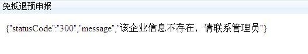

## 出口退税

---

    添加出口退税功能菜单

   一是纳税人因三证合一，变更了纳税人识别号，在出口退税系统中更新信息，需添加新税号的出口退税功能菜单；二是新办纳税人在出口退税审核系统中维护好资格信息后，要求添加。
   网上办税平台每天晚上从出口退税系统提取符合资格的信息，并自动为纳税人添加出口退税功能菜单；

    我通过网上办税平台进行出口退税远程申报时，必须要进行预申报吗？

   未进行预申报的，可以进行正式申报，在审核系统中没有强制要求必须先完成预申报。
   建议企业先进行预申报，以尽早发现疑点。

    我是出口退税企业，本月没有出口退税业务，是否也需要进行申报？

   生产企业每月均需按时申报，不论是否产生了出口退税业务。
   
   外贸企业可以只在发生业务的月份进行申报。
     
    我是出口退税企业，进行预申报为何提示失败？

   

   2016年1月出口退税企业申报系统进行了升级，生产类企业出口退税申报系统版本为15.0   外贸类企业出口退税申报系统版本为17.0，请升级后再通过网上办税平台进行出口退税预申报、正式申报。

    我单位三证合一后变更了新税号，今天已在税务局出口退税审核系统中变更了登记信息，为什么登录网上办税平台进行预申报时提示“企业信息不存在，请联系管理员”？
   
   
   网上办税平台从税务局出口退税审核系统中提取信息需间隔一天，如有纳税人识别号信息的变更，请间隔一天再登录网上办税平台进行预申报或正式申报。

    出口退税申报系统（单机版客户端）中生成申报数据时选择远程申报，无法直接将申报数据传输到出口退税综合服务平台中,请问如何解决？

   请在出口退税申报系统（单机版客户端）生成申报数据时选择远程申报，申报文件系统将申报数据文件自动存入本地，如未能自动登录网上办税平台，请通过浏览器方式登录，然后点击网上办税平台相关菜单，上传存放在本地已生成的申报数据文件即可。

    出口退税预申报时提示“审核失败，无法读入企业申报商品代码版本”，请问如何处理？

   2016年2月申报期进行出口退税预申报前，请先升级代码库，然后重新生成申报数据进行远程申报。

    我通过网上办税平台进行出口退税远程申报时，必须要进行预申报吗？

   未进行预申报的，可以进行正式申报，在审核系统中没有强制要求必须先完成预申报。建议企业先进行预申报，以尽早发现疑点。

    生产企业已经填写完成单证明细数据采集填写退运已补税（未退税）证明申请，成功保存，要进行生成单证申报数据的时候，显示无数据？

   填写完成退运已补税（未退税）证明申请表后需要点击设置标志即可。

    生产用户提出没有生成明细数据模块，那企业还需要进行预申报吗，如果操作在哪生成预申报数据？

   新版系统调整内容，企业仍需要预申报做预审，在操作生成免抵退申报数据后生成的数据包为预审数据包，如预审无疑点，此数据包可直接作为正式申报的数据包。如有疑点需要撤销数据修改数据后重新生成的免抵退申报数据再进行预审，直到预审无疑点后可作为正式申报的数据包。

    单机版用户提出出口退免税资格认定变更表生成数据后无法打印报表？

   企业操作问题，出口退税资格认定变更表单应录入数据后先打印之后再生成数据，建议企业按照认定向导操作。生成后如想在打印报表需撤销数据到采集状态后打印报表。

    出口退税系统的正式申报怎么不能上传了，以前都是这样操作的？

   出口退税系统本月升级后调整如下：先进行预申报，预申报成功后，在反馈信息下载项中有“转正式申报”,点击“转正式申报”进行正式申报。

    三证合一之后没有出口退税模块怎么处理？

   关于三证合一后出口退税系统资格的维护，目前经与省局出口退税处确认，无出口退税资格或已三证合一未维护新老税号对应关系的，纳税人向主管税务机关出口退税部门反映，通过出口退税系统运维提报，省局出口退税处负责维护。

    三证合一后出口退税预申报反馈提示信用代码与审核系统不一致怎么办？

   出口退税预审时候提示社会信用代码和审核系统（  ）不一致，遇到这种提示，如果版本什么的都对，那就是由于：三证合一之后，重新安装了客户端，首次登陆，有两个空，一个是税号，一个是社会信用代码，两个都填上新的社会统一信用代码，重新上传申报。

   
