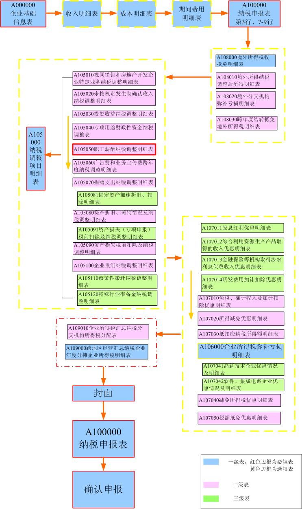

## 所得税年度申报

---

    我单位进行年度所得税申报时，A000000企业基础信息表的第一行无法选择，如需更正申报该怎么操作？

   网上办税平台只能接收“正常申报”类型的数据，不能进行“更正申报”或“补充申报”，因此本表面向所有用户均默认为“正常申报”，不可自行选择。如有“更正申报”或“补充申报”请到主管税务机关办税服务厅办理；或在金税三期核心征管系统中作废已申报信息后，联系96005656退回网上办税平台年度所得税报表，再重新申报。

    年度企业所得税申报时，有无填表顺序？应按什么顺序进行填报？

   通过网上办税平台进行年度企业所得税申报时，建议按以下顺序填报：

1. A000000企业基础信息表
2. 企业收入明细表
3. 成本支出明细表
4. A104000期间费用明细表
5. A100000中华人民共和国企业所得税年度纳税申报表（A类）
6. 纳税调整类报表（先填子表再填上一级报表）
具体请参照下图（红色边框为必填表）：

    我单位符合小微优惠条件，进行年度所得税申报时， 为何A107040表第一、第二行均为0，且不能手工填写数据，小微优惠金额怎么填写？

  《A107040减免所得税优惠明细表》未自动计算的原因：一是不符合小微优惠条件；二是符合小微优惠条件但《A100000中华人民共和国企业所得税年度纳税申报表（A类）》尚未保存，无法实现自动计算。
  
  解决办法：一是确定《A000000企业基础信息表》及《A100000中华人民共和国企业所得税年度纳税申报表（A类）》相关项是否符合小微优惠；二是参照填表顺序，按顺序分别填写保存相关报表，并在保存《A100000中华人民共和国企业所得税年度纳税申报表（A类）》后，再打开《A107040减免所得税优惠明细表》，符合条件的即可看到自动计算的数据，然后保存本表即可。

    我单位为核定征收类小微企业，进行年度企业所得税申报时，为何不能在“是否属于小型微利企业：”选择“是”？

  请在《中华人民共和国企业所得税月（季）度和年度纳税申报表（B类，2015年版）》中，“年度申报时填报”栏中选择行业、填写从业人数、资产总额（万元），及选择“国家限制和禁止行业:”情况，保存报表时系统将根据您填写的情况及第11行或第14行“应纳税所得额”进行判断，符合条件的，系统自动计算第17、18行小型微利企业减免所得税额。

    年度所得税申报信息写征管系统失败，失败原因：核心征管内部异常||调用核心征管内部服务出错,异常所在server名hxqz_sdgs_svr003，错误原因：1019900000001:系统出现异常！请联系管理员。怎么处理？

   这种情况让纳税人先看下A107040表第29行，企业只填写金额，不选择项目名称的是无法写入征管的，目前年度所得税申报失败的多为此类情况。
 
     年度关联业务往来报告表必须要申报吗？
 
   关于年度关联业务往来报告表申报：

  （1）营业收入过亿的为强制申报。税务机关要求必须申报的，按税务机关要求填写并确认申报。 
  （2）营业收入未过亿，税务机关也未要求填报的，纳税人可不填写，如纳税人已填写或已被退回的不确认申报即可，不需要删除报表权限。