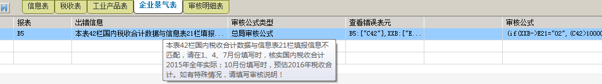

## 重点税源

---

    登录网上办税平台后，为什么不显示重点税源模块?

   网上办税平台仅对山东省国家税务局确定名单中的企业开放本模块，未显示此模块的无需申报。若您是重点税源企业，本年度有变更税号的情况时，请用原税号完成当前年度各期申报，下一年度再启用变更后的税号申报。

    税收表第20栏本期数和征管数据不同，如何处理？

   第20栏本期数，系统提取的是上期税收表第30栏的数据，而同栏中的征管数据列是提取本期增值税主表第14栏的数据。可根据本取数口径查看数据的一致性。

    我单位填写保存重点税源信息表时，提示统一社会信用代码与登录税号不一致，该如何处理？

   遇到此提示时，请在重点税源企业基本信息表第35行“统一社会信用代码”项中填写新税号后再保存。

    重点税源企业景气表审核时提示异常，如下所示，请问如何处理？
   

   请按提示信息调整。其中的42栏是总局重点税源信息采集单机版中是按行次标识，平台显示的报表中项目列前没加行次，42栏的提示按栏目说明“国内税收合计”去确认即可。

    企业所有的税费种都已申报成功，但是在填报重点税源税收报表时，征管数据那列不显示数据，也没有限制提示：未获取征管数据的信息，是什么原因？

   重点税源报表中的增值税、消费税、所得税本期数据，由网上办税平台定时从核心征管系统中获取，完成以上税种申报后，一般需间隔一天再申报重点税源报表，其中所得税为税管员审核写入征管后才能提取，即用户在外网申报状态为“申报成功”才提取。可将此问题发送到省局后台提取数据后再进行填写申报。

    